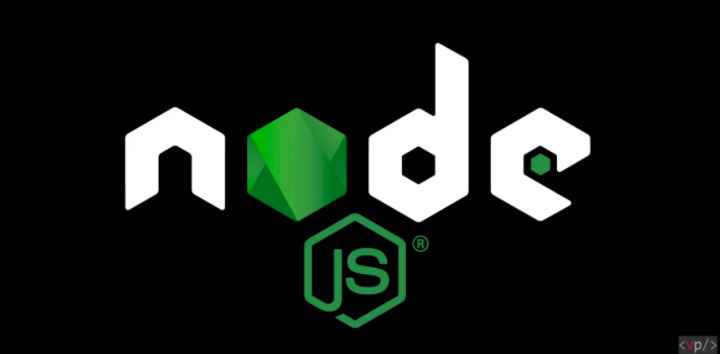

# Node.js + React + Express

### Study Materials
> 1. 인프런 강좌 (NEW - 2018년) 베이직 코스 13강
> 1. 인프런 강좌 (OLD - 2016년) 중급코스 35강
> 1. 노마드코더 - 아폴로노트 만들기 강좌

  
## 누구나 하는 React 유튜브 목록 (NEW - 2018년)
### Dev-tools
> * sandbox 온라인 에디터
> * vsCode 오프라인 에디터

1. **누구나하는 리액트** : [#1 소개-초심자를 위한 리액트 핵심 강좌](https://www.youtube.com/watch?v=fT9iFFAt60E&index=1&list=PL9FpF_z-xR_E4rxYMMZx5cOpwaiwCzWUH) ... [▶3:57]
1. **누구나하는 리액트** : [#2 프론트엔드 라이브러리란 무엇인가?]( https://www.youtube.com/watch?v=_aBq1SKl6yQ&index=2&list=PL9FpF_z-xR_E4rxYMMZx5cOpwaiwCzWUH) ... [▶9:11]
1. **누구나하는 리액트** : [#3 리액트의 Virtual DOM](https://www.youtube.com/watch?v=wKwMRH0PkMg&index=3&list=PL9FpF_z-xR_E4rxYMMZx5cOpwaiwCzWUH) ... [▶4:28]
1. **누구나하는 리액트** : [#4 리액트를 특별하게 만드는 점](https://www.youtube.com/watch?v=aP5rmFZ70js&index=4&list=PL9FpF_z-xR_E4rxYMMZx5cOpwaiwCzWUH) ... [▶4:25]
1. **누구나하는 리액트** : [#5 본격적인 리액트 코드 작성하기]( https://www.youtube.com/watch?v=Op0EE8v7qEs&index=5&list=PL9FpF_z-xR_E4rxYMMZx5cOpwaiwCzWUH) ... [▶7:55]
1. **누구나하는 리액트** : [#6 JSX 기본 문법 알아보기 (i)](https://www.youtube.com/watch?v=8RVoVvgaQdY&index=6&list=PL9FpF_z-xR_E4rxYMMZx5cOpwaiwCzWUH) ... [▶0:31]
1. **누구나하는 리액트** : [#7 JSX 기본 문법 알아보기 (ii)](https://www.youtube.com/watch?v=N96EJm09Pxo&index=7&list=PL9FpF_z-xR_E4rxYMMZx5cOpwaiwCzWUH) ... [▶7:29]
1. **누구나하는 리액트** : [#8 Props](https://www.youtube.com/watch?v=tZLQ-cNCf70&index=8&list=PL9FpF_z-xR_E4rxYMMZx5cOpwaiwCzWUH) ... [▶2:03]
1. **누구나하는 리액트** : [#9 State](https://www.youtube.com/watch?v=mYEZh6TV10M&index=9&list=PL9FpF_z-xR_E4rxYMMZx5cOpwaiwCzWUH) ... [▶8:45]
1. **누구나하는 리액트** : [#10 LifeCycle API (i)](https://www.youtube.com/watch?v=Na_kP7X6KGs&index=10&list=PL9FpF_z-xR_E4rxYMMZx5cOpwaiwCzWUH) ... [▶8:23]
1. **누구나하는 리액트** : [#11 LifeCycle API (ii)](https://www.youtube.com/watch?v=P9XdZK6ZunE&index=11&list=PL9FpF_z-xR_E4rxYMMZx5cOpwaiwCzWUH) ... [▶2:03]
1. **누구나하는 리액트** : [#12 필요한 도구 설치하기](https://www.youtube.com/watch?v=9pLI1UDgDMs&index=12&list=PL9FpF_z-xR_E4rxYMMZx5cOpwaiwCzWUH) ... [▶7:27]
1. **누구나하는 리액트** : [#13 Create React App 사용하기](https://www.youtube.com/watch?v=PnF-wjxbYII&index=13&list=PL9FpF_z-xR_E4rxYMMZx5cOpwaiwCzWUH) ... [▶7:33]
---

  
## REACT.JS 인프런 유튜브 목록 (OLD - 2016년)
### Dev-tools
> * codepen.io, nitrous.io 온라인 에디터
> * Atom 오프라인 에디터

### Chapter 1.0
- **강좌 1-1편** : [강의 소개 ](https://www.youtube.com/watch?v=GEoNiUcVwjE&index=1&list=PL9FpF_z-xR_GMujql3S_XGV2SpdfDBkeC) [139:12]
- **강좌 1-2편** : [React.js 소개 ](https://www.youtube.com/watch?v=H24D0GveBYY&index=2&list=PL9FpF_z-xR_GMujql3S_XGV2SpdfDBkeC) [38:55]
- **강좌 1-3편** : [React.js 장점과 단점 ](https://www.youtube.com/watch?v=fISs08P6eMc&index=3&list=PL9FpF_z-xR_GMujql3S_XGV2SpdfDBkeC) [44:46]

### Chapter 2.0
- **강좌 2-1편** : [Codepen 설정 , ES6 클래스 ](https://www.youtube.com/watch?v=LxiXsB9m2co&index=4&list=PL9FpF_z-xR_GMujql3S_XGV2SpdfDBkeC) [6:54]
- **강좌 2-2편** : [JSX의 특징 ](https://www.youtube.com/watch?v=5MF-ThMob-s&index=5&list=PL9FpF_z-xR_GMujql3S_XGV2SpdfDBkeC) [67:23]
- **강좌 2-3편** : [props ](https://www.youtube.com/watch?v=atSIfMAmSic&index=6&list=PL9FpF_z-xR_GMujql3S_XGV2SpdfDBkeC) [78:54]
- **강좌 2-4편** : [state ](https://www.youtube.com/watch?v=i_ooWEUtCMc&index=7&list=PL9FpF_z-xR_GMujql3S_XGV2SpdfDBkeC) [811:15]
- **강좌 2-5편** : [컴포넌트 매핑 (Component Mapping) ](https://www.youtube.com/watch?v=x3rhCJWGFc4&index=8&list=PL9FpF_z-xR_GMujql3S_XGV2SpdfDBkeC) [96:51]

### Chapter 3.0
- **강좌 3-1편** : [작업환경 설정하기 ](https://www.youtube.com/watch?v=moXE6GUEwOs&index=9&list=PL9FpF_z-xR_GMujql3S_XGV2SpdfDBkeC) [1024:03]
- **강좌 3-2편** : [React Project 만들기 | NPM, WEBPACK ](https://www.youtube.com/watch?v=gSwO2S-Q88s&index=10&list=PL9FpF_z-xR_GMujql3S_XGV2SpdfDBkeC) [118:08]
- **강좌 3-3편** : [Hot Module Replacement | React Hot Loader ](https://www.youtube.com/watch?v=9xZ3x3u1Avk&index=11&list=PL9FpF_z-xR_GMujql3S_XGV2SpdfDBkeC) [1212:14]

### Chapter 4.0
- **강좌 4-1편** : [Contact 검색기능 구현 | input, sort, filter ](https://www.youtube.com/watch?v=LSTVOuyF6zE&index=12&list=PL9FpF_z-xR_GMujql3S_XGV2SpdfDBkeC) [15:11]
- **강좌 4-2편** : [Contact 선택기능 구현 | React.js 기초개념 응용 ](https://www.youtube.com/watch?v=j8oalkWrQrg&index=13&list=PL9FpF_z-xR_GMujql3S_XGV2SpdfDBkeC) [1413:36]
- **강좌 4-3편** : [state 내부 배열 처리하기 | Immutability Helper / ES6 Spread ](https://www.youtube.com/watch?v=l5bt79f4aHs&index=14&list=PL9FpF_z-xR_GMujql3S_XGV2SpdfDBkeC) [155:35]
- **강좌 4-4편** : [Contact 추가/삭제/수정 기능 구현 | Immutability Helper 적용하기 ](https://www.youtube.com/watch?v=48ZtoaWIL_Y&index=15&list=PL9FpF_z-xR_GMujql3S_XGV2SpdfDBkeC) [169:03]
- **강좌 4-5편** : [Contact 데이터 추가 기능 구현 | 컴포넌트 응용 ](https://www.youtube.com/watch?v=L2HZ2OLIhuc&index=16&list=PL9FpF_z-xR_GMujql3S_XGV2SpdfDBkeC) [187:33]
- **강좌 4-6편** : [Contact 데이터 삭제/수정 기능 구현 | 컴포넌트 응용 ](https://www.youtube.com/watch?v=u6aJjPw0c_c&index=17&list=PL9FpF_z-xR_GMujql3S_XGV2SpdfDBkeC) [197:03]
- **강좌 4-7편** : [Contact 엑스트라 기능 구현 | KeyPress, ref ](https://www.youtube.com/watch?v=_cnRCixxaHQ&index=18&list=PL9FpF_z-xR_GMujql3S_XGV2SpdfDBkeC) [357:53]
- **강좌 4-8편** : [Component LifeCycle API ](https://www.youtube.com/watch?v=OUAOo1N-EDs&index=19&list=PL9FpF_z-xR_GMujql3S_XGV2SpdfDBkeC) [349:50]
- **강좌 4-9편** : [Contact 데이터 새로고침해도 유지하기 | localStorage ](https://www.youtube.com/watch?v=C_qTjHBlkks&index=20&list=PL9FpF_z-xR_GMujql3S_XGV2SpdfDBkeC) [219:57]

### Chapter 5.0
- **강좌 5-1편** : [Redux - 배경지식 | MVC, FLUX ](https://www.youtube.com/watch?v=LRUQfJLuPA8&index=21&list=PL9FpF_z-xR_GMujql3S_XGV2SpdfDBkeC) [2211:20]
- **강좌 5-2편** : [Redux - 특징과 흐름 ](https://www.youtube.com/watch?v=59XSBf00GpY&index=22&list=PL9FpF_z-xR_GMujql3S_XGV2SpdfDBkeC) [237:02]
- **강좌 5-3편** : [Redux - 프로젝트 준비하기 | create-react-app ](https://www.youtube.com/watch?v=rNhstoL9MME&index=23&list=PL9FpF_z-xR_GMujql3S_XGV2SpdfDBkeC) [2417:18]
- **강좌 5-4편** : [Redux - 프로젝트 구조 설정 및 컴포넌트 생성 ](https://www.youtube.com/watch?v=xX0eQLQ3IJw&index=24&list=PL9FpF_z-xR_GMujql3S_XGV2SpdfDBkeC) [258:06]
- **강좌 5-5편** : [Redux - Action ](https://www.youtube.com/watch?v=_RwMVm1gVuM&index=25&list=PL9FpF_z-xR_GMujql3S_XGV2SpdfDBkeC) [2615:59]
- **강좌 5-6편** : [Redux - Reducer ](https://www.youtube.com/watch?v=YdlbmiAtD_4&index=26&list=PL9FpF_z-xR_GMujql3S_XGV2SpdfDBkeC) [278:20]
- **강좌 5-7편** : [Redux - Store ](https://www.youtube.com/watch?v=dmxA42uXo0I&index=27&list=PL9FpF_z-xR_GMujql3S_XGV2SpdfDBkeC) [2819:34]
- **강좌 5-8편** : [Redux - react-redux | 컴포넌트에서 사용하기 ](https://www.youtube.com/watch?v=bp_eliWWWRA&index=28&list=PL9FpF_z-xR_GMujql3S_XGV2SpdfDBkeC) [292:46]

### Chapter 6.0
- **강좌 6-1편** : [Backend-소개 ](https://www.youtube.com/watch?v=a7WIKopjA38&index=29&list=PL9FpF_z-xR_GMujql3S_XGV2SpdfDBkeC) [3013:38]
- **강좌 6-2편** : [Backend-Node.js / Express.js 맛보기 | 라우팅, 모듈화 ](https://www.youtube.com/watch?v=K-Pfx4K1Rbo&index=30&list=PL9FpF_z-xR_GMujql3S_XGV2SpdfDBkeC) [3113:20]
- **강좌 6-3편** : [Backend-Express | 미들웨어(middleware) ](https://www.youtube.com/watch?v=sB5YRnrp0H4&index=31&list=PL9FpF_z-xR_GMujql3S_XGV2SpdfDBkeC) [324:58]
- **강좌 6-4편** : [Backend-MongoDB 소개 ](https://www.youtube.com/watch?v=eh1Lz6imsBM&index=32&list=PL9FpF_z-xR_GMujql3S_XGV2SpdfDBkeC) [337:56]
- **강좌 6-5편** : [Backend-MongoDB 기본명령어 (i) | 생성 및 제거 ](https://www.youtube.com/watch?v=SpEnZCU5VbY&index=33&list=PL9FpF_z-xR_GMujql3S_XGV2SpdfDBkeC) [187:33]
- **강좌 6-6편** : [Backend-MongoDB 기본명령어 (ii) | find()](https://www.youtube.com/watch?v=m5k0RGd5rSI&index=34&list=PL9FpF_z-xR_GMujql3S_XGV2SpdfDBkeC) [187:33]
- **강좌 6-7편** : [Backend-MongoDB 기본명령어 (iii) | sort, limit, skip, update ](https://www.youtube.com/watch?v=OSI3jKrWGl4&index=35&list=PL9FpF_z-xR_GMujql3S_XGV2SpdfDBkeC) [197:03]

---

  
## NOMAD Notes : 오프라인노트 with 아폴로
1. **노트앱 만들기 (#0-01.)** [Intro - Build an Offline Note Taking App with React~](https://www.youtube.com/watch?v=A4Grb-bm0Ok&index=1&list=PL7jH19IHhOLMTVBzUkbN74h1nyXW7VhYV) ... [03:01]
1. **노트앱 만들기 (#0-02.)** [Requirements - Build an Offline Note Taking App](https://www.youtube.com/watch?v=yzfTIUfKHqA&index=2&list=PL7jH19IHhOLMTVBzUkbN74h1nyXW7VhYV) ... [00:58]
1. **노트앱 만들기 (#1-01.)** [Set Up - Build an Offline Note Taking App with Reac~](https://www.youtube.com/watch?v=gCGF50zGW1U&index=3&list=PL7jH19IHhOLMTVBzUkbN74h1nyXW7VhYV) ... [05:37]
1. **노트앱 만들기 (#1-02.)** [Configuration - Build an Offline Note Taking App wi~](https://www.youtube.com/watch?v=Mnx4R6JzSU0&index=4&list=PL7jH19IHhOLMTVBzUkbN74h1nyXW7VhYV) ... [07:09]
1. **노트앱 만들기 (#1-03.)** [Type Definitions for Offline Schema](https://www.youtube.com/watch?v=HvMm5AxhSwU&index=5&list=PL7jH19IHhOLMTVBzUkbN74h1nyXW7VhYV) ... [05:44]
1. **노트앱 만들기 (#1-03a)** [Intermission for Bug Fixing](https://www.youtube.com/watch?v=zBDPoIH-ANo&index=6&list=PL7jH19IHhOLMTVBzUkbN74h1nyXW7VhYV) ... [02:42]
1. **노트앱 만들기 (#1-04.)** [Note Query part One](https://www.youtube.com/watch?v=w4zm_HWO6Sg&index=7&list=PL7jH19IHhOLMTVBzUkbN74h1nyXW7VhYV) ... [08:16]
1. **노트앱 만들기 (#1-05.)** [Note Query part Two](https://www.youtube.com/watch?v=tplFDbjlZis&index=8&list=PL7jH19IHhOLMTVBzUkbN74h1nyXW7VhYV) ... [05:22]
1. **노트앱 만들기 (#1-06.)** [Add Note Mutation](https://www.youtube.com/watch?v=wxkalxbeJys&index=9&list=PL7jH19IHhOLMTVBzUkbN74h1nyXW7VhYV) ... [09:21]
1. **노트앱 만들기 (#1-07.)** [Edit Note Mutation](https://www.youtube.com/watch?v=avjGl2xSXvs&index=10&list=PL7jH19IHhOLMTVBzUkbN74h1nyXW7VhYV) ... [09:46]
1. **노트앱 만들기 (#1-08.)** [Router and Routes](https://www.youtube.com/watch?v=jvgm3sJmkNU&index=11&list=PL7jH19IHhOLMTVBzUkbN74h1nyXW7VhYV) ... [08:09]
1. **노트앱 만들기 (#1-09.)** [Notes Route](https://www.youtube.com/watch?v=_D0omxOOH1U&index=12&list=PL7jH19IHhOLMTVBzUkbN74h1nyXW7VhYV) ... [05:36]
1. **노트앱 만들기 (#1-10.)** [Note Route](https://www.youtube.com/watch?v=Wp8zud7hCXY&index=13&list=PL7jH19IHhOLMTVBzUkbN74h1nyXW7VhYV) ... [10:08]
1. **노트앱 만들기 (#1-11.)** [Add Note Route](https://www.youtube.com/watch?v=w3wcCf43XaA&index=14&list=PL7jH19IHhOLMTVBzUkbN74h1nyXW7VhYV) ... [09:46]
1. **노트앱 만들기 (#1-12.)** [Edit Note Route](https://www.youtube.com/watch?v=mAh-TzMpHrQ&index=15&list=PL7jH19IHhOLMTVBzUkbN74h1nyXW7VhYV) ... [08:12]
1. **노트앱 만들기 (#1-13.)** [Saving the Notes Offline](https://www.youtube.com/watch?v=r5wg9sreVhM&index=16&list=PL7jH19IHhOLMTVBzUkbN74h1nyXW7VhYV) ... [06:31]
1. **노트앱 만들기 (#1-14.)** [Restoring Offline Notes](https://www.youtube.com/watch?v=vmfDR1MDXkY&index=17&list=PL7jH19IHhOLMTVBzUkbN74h1nyXW7VhYV) ... [04:38]
1. **노트앱 만들기 (#1-15.)** [Conclusions](https://www.youtube.com/watch?v=RwZWIFcqYAs&index=18&list=PL7jH19IHhOLMTVBzUkbN74h1nyXW7VhYV) ... [01:10]

---
